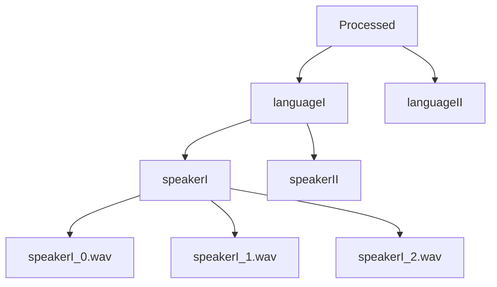

# tts_data_prep
create a 99% clean data corpus of single-speaker utterances from open-source data. 
## How to use-
1. Download the repo and install all the packages.
2. Add your data to the "speaker_data" file and run main.py.
3. Ensure the data is correctly filled in the file, or you will get incorrect results.
4. A segment should be at least 10-20 seconds.
## Input-
It is a speaker data file consisting of,
1. Speaker: the speaker's name. It is a unique attribute.
2. link: Link1, Link2, .. Link5. YouTube video links of the speaker.
3. segment_start: segment_start1, segment_start2, ... segment_start5. starta of the segment for Link1, Link2, .. Link5 consequtively.
4. segment_end: segment_end1, segment_end2, ... segment_end5. enda of the segment for Link1, Link2, .. Link5 consequtively.
5. language: language of the speaker
6. A maximum of 5 video links can be added.
## Output-

## Working-
1. Utilizes the 'pyannote.audio' library for primary diarization of audio files.
2. Utilizes the 'resemblyzer' library to filter out remaining speaker segments that contain overlapping of other speakers or any noise.
4. Identifies the main/reference speaker using cosine similarity.
5. Chunks and stores the extracted speech segments into sentences based on maximum silence in the given time frame.
